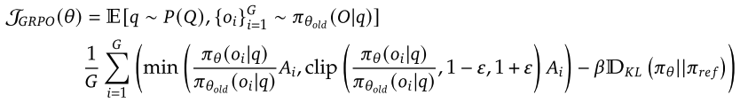
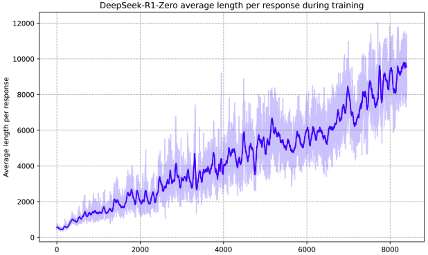

It has not been a long time since DeepSeek was released. It was indeed a shock to those who are in AI industry.
I was not familiar with LLM’s algorithm and the computing resource usage of the LLMs. All I was doing was toutilise the LLM APIs for developers to build pipelines for automation. Other than that, nothing much was to consider.
When DeepSeek stroke the LLM industry, people eagerly talked about the algorithm and how light the model is compared to the other models such as GPT from OpenAI and Llama from Meta.
I would like to meticulously analyze DeepSeek, especially how it was designed to distill with open source models and how they used dataset to train the model.

# 1. Abstract
In the paper, two reasoning models are introduced: DeepSeek-R1-Zero and DeepSeek-R1. DeepSeek-R1-Zero seemed to be a model before supervised fine-tuning.
In the abstract , two models are summarised with features below.
- **DeepSeek-R1-Zero**
    - without suvervised fine-tunining(SFT)
    - pros
        - remarkable reasoning capabilities
        - naturally emerges with numerous powerful and intriguing reasoning behaviors
    - cons
        - poor readability (human cannot understand the output)
        - poor language mixing

- **DeepSeek-R1**
    - developed to overcome the shortcomings of DeepSeek-R1-Zero        
    - incorporates multi-stage training and cold-start data before RL.
    - comparable to OpenAI-o1-1217
---
According to the paper, the benchmark performance of DeepSeek-R1 surpasses OpenAI-o1-mini and show a similar performance with OpenAI-o1-1217. The performance metrics are as below in the table.

| Model           | AIME2024 | Codeforces | GPQA Diamonds | MATH-500 | MMLU | SWE-bench Verified |
| --------------- | -------- | ---------- | ------------- | -------- | ---- | ------------------ |
| DeepSeek-R1     | 79.8     | 96.3       | 71.5          | 93.7     | 90.8 | 49.2               |
| OpenAI-o1-1217  | 79.2     | 96.6       | 75.7          | 96.4     | 91.8 | 48.9               |
| DeepSeek-R1-32B | 72.6     | 90.6       | 62.1          | 94.3     | 87.4 | 36.8               |
| OpenAI-o1-mini  | 63.6     | 93.4       | 60.0          | 90.0     | 85.2 | 41.6               |
| DeepSeek-V3     | 39.2     | 58.7       | 59.1          | 90.2     | 88.5 | 42.0               |

# 2. Introduction
In the paper, it kicks off by mentioning that OpenAI o1 was the first to be introduced for reasoning tasks but the effective test-time scaling is still challenged, and other works were not comparable to o1 models.
- Why was DeepSeek R1 model was developed?
    - To improve language model reasoning capabilities with RL(reinforcement learning)
- How?
    - DeepSeek-R1-Zero: DeepSeek-V3-Base's output pass through GRPO, to update parameters in accordance with the scores
    - DeepSeek-R1: RL and cold-start data, and multi stage training pipeline

Basically, this paper emphasises on the fact that LLM could be optimised and incentivised through RL without supervised fine-tuning(SFT)

# 3. Approach
In chapter 2, DeepSeek team mentions the algorithm, Group Relative Policy Optimisation (GRPO). This algorithm is utilised to train the model by optimising outputs, which consists of new policy and old policy. Also this paper says critic model is forgone. It is the same size as the policy model, which I think is one of the factors that enables the DeepSeek-R1-Zero to be lighter by reducing a significant amount of computational process.

GRPO equation looks as below.

The gist of the algorithm is to sample outputs from old policy and calculate possibilities. The ratio of new policy’s output and old policy’s output is then _clipped_ within the range of $1 - \epsilon, 1+\epsilon$
to prevent from getting too much bias either on the new policy or the old policy.
### rewards
There are two reward methods to which the model resort. The model will take the rewards when the output scores meaningfully. It leverages the rewards to update its weight in a direction where the score is evaluated good, whereas the less score will be then refined or ablated so only the useful scores remain.
- accuracy rewards: it evaluates the response like math problem results or classification results.
- format rewards: it enforces the model to have its reasoning process in the tags like '\<think>\</think>'

# 4. Key Point
DeepSeek-R1-Zero model showed that it actually is autonomously learning. The more learning steps it takes, the more time it takes to response, which means it thinks more before responding.

By its output after GRPO calculation, the model learns itself with knowledge it spits and takes it back to strengthen what it is sure about. It even reaches to the point where there is an "aha" moment, a moment when it realises itself what the knowledge should be or meant to be.

Yet still, DeekSeek-R1-Zero's reasoning process has the drawback of *poor readability*. If humans cannot understand the outputs from its weights, it will be useless. This is the reason why DeepSeek-R1 is designed to perform with robust readability.

### DeepSeek-R1?
DeepSeek-R1 model takes a few data to be supervised-fine-tuned with the sampling data from DeepSeek-R1-Zero's output. Human annotators would filter and sample the data to be utilised or not utilised for DeepSeek-R1 model to be enforced to have better readability and reasoning ability. Approximately 600k reasoning related training samples and 200k unreasoning training samples were collected to feed the model.

### Process in Summary
The process in this paper for reinforcement learning of the models is summarised as below.

* DeepSeek-V3-Base -> DeepSeek-R1-Zero -> DeepSeek-R1(with Zero's data for cold-start) -> DeepSeek-R1(with RL as Zero model did) -> Distillation

### How Test Was Done
An intriguing part is the test part. There are many test methods for LLMs performance in unique domains like math, reasoning and others. The paper claims that 16 answers were selected and the overall average accuracy was calculated.

# 5. Reflection
This was my first LLM paper review. I felt awkward with the concepts of terms used in the paper like checkpoint, RL for LLM, rewards and so on. Quite a challenging moment it had been, and motivating to read the paper.
It was also thrilling that the model could learn by itself by choosing rewards and taking the right output so it could develop its own universe of tensor.
Once I had a doubt that the methodology of developing LLMs with vectors and tensors could be wrong and there are other ways to have a better performing models, but then realised that the numbers and floats in tensors are the best efficient way to store and calculate to reflect LLM and maybe it is by the nature meant to be this way. *Number* is the only way for now to express a data from a cell though.

# 6. Reference
[1] DeepSeek-AI, Guo, D., Yang, D., Zhang, H., Song, J., Zhang, R., et al. (2024). DeepSeek-R1: Incentivizing Reasoning Capability in LLMs via Reinforcement Learning. arXiv preprint arXiv:2501.12948